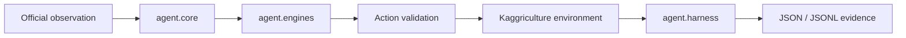

# Kaggriculture Bot 🌾

> A safe, reproducible starting point for building a Kaggriculture agent —
> with a local harness, deterministic heuristics, evidence artifacts, and a
> submission package you can inspect before uploading.

This repository is designed for a simple goal: make experimentation with a
farm-playing agent feel calm and dependable. Strategy code stays separate from
the game adapter and runner, so you can improve the bot without rewriting the
submission boundary each time.

The current submission candidate is **`leader-v2`**, a deterministic cycle
planner benchmarked from leader replays. It creates a daily economic budget,
explicit production goals, and exclusive unit-task reservations before acting.
When a command cannot be established from the observation, the submission
boundary falls back to `PASS` rather than inventing a mechanic.

## What is included

- A typed action boundary with a final safety validator.
- A strategy-agnostic episode runner with deterministic seeds and time limits.
- JSON episode reports and optional JSONL decision traces.
- Built-in PASS, deterministic-random, and self-play scenarios.
- Five engines: a conservative baseline, `heuristic-v1`, `competitive`,
  `leader-inspired`, and the submission candidate `leader-v2`.
- A submission packager that produces a tarball with `main.py` at its root.
- Unit tests and quality gates for the public harness and the V1 policy.

## Quick start

The project targets **Python 3.11+** and uses [uv](https://docs.astral.sh/uv/).

```bash
git clone <your-fork-url>
cd Kaggriculture_bot
uv sync
```

Run the local quality checks:

```bash
uv run ruff format --check agent tests
uv run ruff check agent tests
uv run ty check agent tests
uv run pytest
```

## Build a submission

Create a small, portable archive:

```bash
uv run python -m agent.harness package-submission \
  --output dist/kaggriculture-submission.tar.gz

uv run python -m agent.harness validate-submission \
  --path dist/kaggriculture-submission.tar.gz
```

The archive contains only `main.py` and runtime Python modules. It deliberately
excludes reports, tests, documentation, local paths, and Graphify artifacts.
Upload the resulting tarball manually through Kaggle once it has passed your
local evidence checks.

## Run scenarios and collect evidence

The optional competition dependency provides the official local environment:

```bash
uv sync --group competition

uv run --group competition python -m agent.harness benchmark --scenario v1-pass
uv run --group competition python -m agent.harness benchmark --scenario v1-random
uv run --group competition python -m agent.harness benchmark --scenario v1-self-play
```

Each scenario uses explicit seeds. Results are written as versioned JSON under
`reports/`; add `--log-turns` to a `run` or `smoke` command for a JSONL stream
of turn-level actions, fallbacks, exceptions, and latency.

> **Note:** the official environment is optional. If its native dependencies
> are unavailable on your machine, unit tests and package validation still run;
> complete the official smoke matrix on a compatible host before submitting.

## How the bot is structured



| Area | Responsibility |
|---|---|
| `agent/core/` | Contracts, state normalization, and action validation. |
| `agent/engines/` | Decision policies such as `heuristic-v1`. |
| `agent/harness/` | Environment lifecycle, scenarios, reporting, and CLI workflows. |
| `main.py` | Kaggle submission entry point. |
| `tests/` | Regression coverage for policy, harness, artifacts, and packaging. |
| `docs/` | Architecture decisions, operational guides, and engine notes. |

## Leader V2 engine, in plain language

The Leader V2 engine plans a complete production cycle before allocating one
legal task per available unit:

1. Reserve daily budget for feed, animals, seeds, labor, and cash safety.
2. Complete harvest, feed, care, fertilizer, watering, and storage obligations.
3. Reserve each worker to one productive target, preventing duplicate pickup and drop trips.
4. Buy an animal only when its structure, placement, feed, and care chain is operational.
5. Sell from price projections to fund positive investments, free shed capacity, or close the season.

The engine uses only officially observed state and action fields. Its budget,
goals, and reservations are deliberately explicit so future strategies can be
tested without coupling them to the adapter or submission boundary.

Read the [leader engine policy](docs/engines/LEADER_INSPIRED.md) for replay
provenance, safeguards, and benchmark criteria.

## Development workflow

Before opening a pull request or building a candidate, run:

```bash
uv run pre-commit run --all-files
```

Useful references:

- [Architecture](docs/architecture/ARCHITECTURE.md)
- [Harness guide](docs/harness/README.md)
- [Benchmark protocol](docs/operations/BENCHMARKS.md)
- [Submission guide](docs/operations/SUBMISSION.md)
- [Backlog](docs/operations/BACKLOG.md)

## Status

The replay-aligned `leader-v2` planner won all 20 reproduced development seeds
against both PASS ($29,641.15 mean) and the official random agent ($20,564.75
mean), with zero errors or fallbacks. Read the [engine
evidence](docs/operations/ENGINE_EVIDENCE.md) for the remaining confirmation
gates and reproduction commands.

---

Built for reliable iteration first — then smarter farming. 🌱
