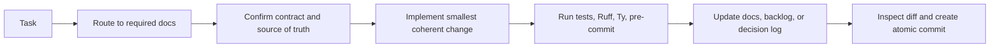

# Agent work guide

## Before changing code

1. Read [`AGENTS.md`](../AGENTS.md).
2. Identify the task in [`README.md`](README.md).
3. Read only the required documents for that task.
4. Check `git status --short` and preserve unrelated work.
5. Locate the relevant backlog item and acceptance evidence.

## Work sequence

## Handoff requirements

Every handoff should state what changed, which contract it relies on, validation
commands and results, known limitations, and commit hashes when applicable.

## Documentation ownership

Do not copy the same contract into multiple documents. Keep one canonical
description and link to it.

| Information | Canonical document |
|---|---|
| Repository rules | `AGENTS.md` |
| Harness behavior | `HARNESS.md` |
| Harness implementation status | `HARNESS_IMPLEMENTATION.md` |
| Strategic architecture | `ARQUITETURA_PROPOSTA.md` |
| Current heuristic | `MVP_HEURISTIC.md` |
| Benchmark methodology | `EXPERIMENTOS_E_BENCHMARKS.md` |
| Work queue | `BACKLOG.md` |
| Assumptions and decisions | `DECISIONS.md` |
| Submission packaging | `CHECKLIST_SUBMISSAO.md` |
