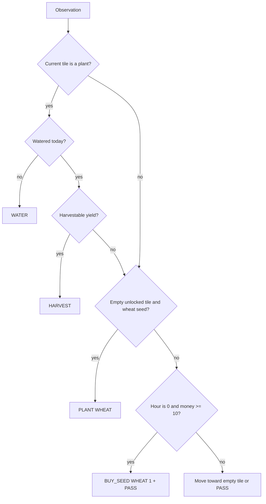

# MVP heuristic

The first engine is intentionally conservative. It protects the farm before it
optimizes the market: water an existing plant, harvest available yield, plant
wheat when a seed is available, buy one wheat seed at the beginning of a turn
day when affordable, then move toward the first empty unlocked tile.

This policy is a baseline, not a claim of competitiveness. Promotion requires
reproducible benchmark evidence against configured opponents and seeds.
