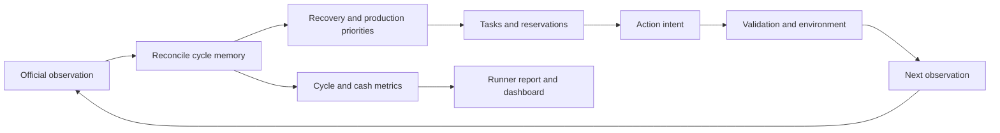

# Architecture

```text
official observation
  -> agent.core contracts
  -> engine proposes raw action
  -> agent.harness validation and execution
  -> official environment
  -> records, reporters, and benchmark artifacts
```

The promoted `leader-v2` engine keeps a process-local cycle memory. It is
reset by the runner at episode start (and also detects a step counter reset),
reconciled before every decision, and never overrides the official
observation. A failed effect blocks only the affected commitment so the
planner can recover that chain from current evidence.



Cycle commitments cover crop stages (plant, water, maturity, harvest, sale),
animal stages (placement, feed, care, collection, production), financial
reservations (next feed, Fibonacci hire, seeds, operating cash), daily hand
state, and expansion readiness. They are diagnostic and continuity state only;
they are not persisted to disk or included in a submission package.

`agent.core` is game-domain code. `agent.harness` is reusable execution
infrastructure. `agent.engines` contains strategy. New planning, market, or RL
modules must depend on the public harness facade rather than its internals.
