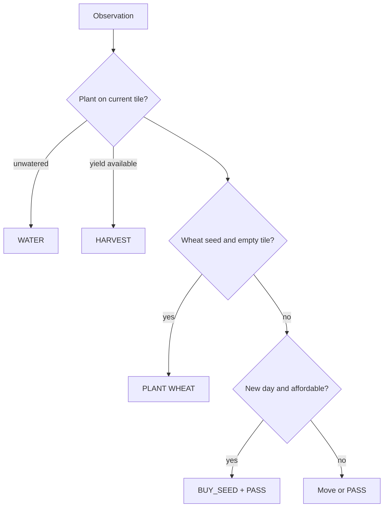

# MVP heuristic

The baseline protects plants first, harvests available yield, plants wheat when
possible, buys a wheat seed at day start, and otherwise moves toward an empty
tile. It returns a candidate action only; harness validation remains mandatory.

