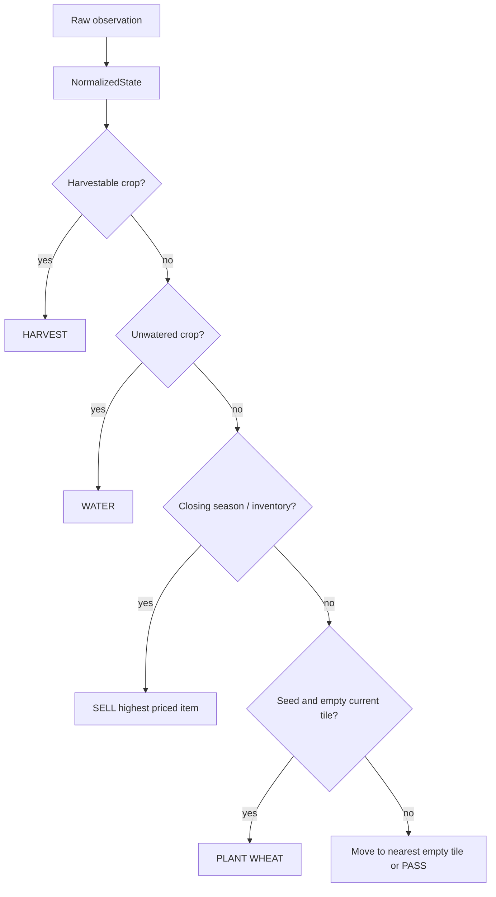

# Heuristic V1

`heuristic-v1` is the deterministic, submission-ready complete-farm safety
candidate. It reads only normalized fields that are present in the official
observation; unknown fields remain outside the policy until captured in an
official fixture.

## Policy and safety

The task order is harvest, water, liquidation, plant, buy one wheat seed, sale,
move, and PASS. The purchase happens only at the beginning of a day when its
known price leaves the configured cash reserve intact. This makes crop
preservation and inventory release dominate discretionary growth. Market
selection uses the highest present numeric price. The current implementation
deliberately does not hire, build, care for animals, or fertilize: their exact
preconditions are not yet covered by official fixtures. Those action families
remain explicit backlog work, not invented mechanics.

`HeuristicV1Config` exposes the close-out threshold (`closing_turns`, default
24), reserve policy (`reserve_cash`, default 10), seed choice (`WHEAT`), and
seed order size (default 1). All generated output is passed through
`core.validate_action` by `main.agent` and the harness.

## Promotion evidence

Use fixed scenarios `v1-pass`, `v1-random`, and `v1-self-play`. A promotion
requires completed official-horizon episodes, no unhandled errors, no unsafe
actions, fallback evidence, and an isolated package validation. The command
examples and current environment limitation are recorded in
[submission operations](../operations/SUBMISSION.md).

The first official local PASS evidence completed at 719 turns with zero errors
and fallbacks (seed 42). It is a safety check, not a performance promotion: the
candidate lost 2990.0 to 3000.0 and still requires the complete scenario matrix.
