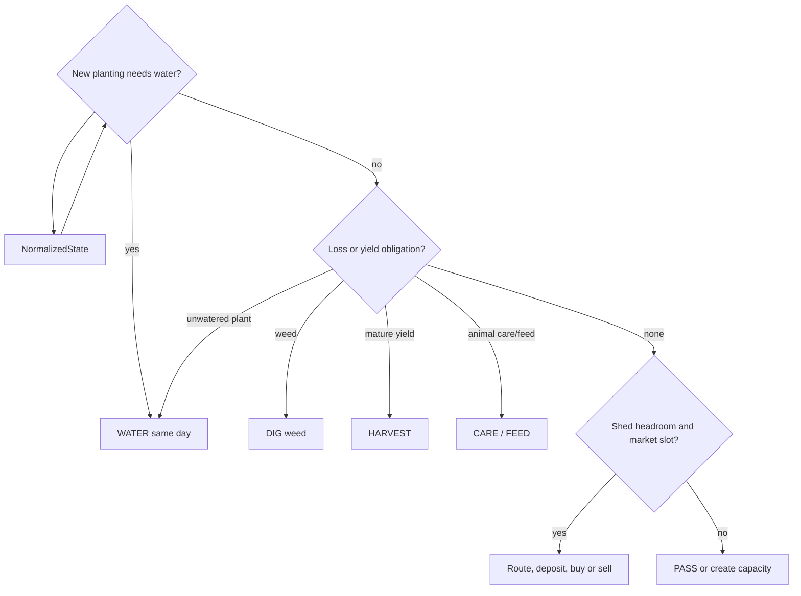

# Heuristic V1

## Competitive candidate

`competitive` replaces V1 at the submission entry point. It uses the official
farmer and hand action shape, assigns distinct board targets by urgency and
distance, sells from the shed before capacity loss, and keeps purchases below a
cash reserve. Its current verified scope is tactical use of crop, shed, hand,
weed, fertilizer-collection, feeding and care fields. Structure/animal
expansion and land purchases remain deliberately unissued until their economic
return simulator and official lifecycle fixtures are covered. The crop-first
candidate is promoted on the completed 1..40 local matrix; future expansion
must preserve that benchmark evidence.

`heuristic-v1` is the deterministic, submission-ready safety baseline. It is
not yet the crop-and-shed economic policy described below. It reads only
normalized fields once available; unknown fields remain outside the policy
until captured in an official fixture.

## Verified policy basis and staged policy

The source environment establishes these planning constraints:

- A planted crop starts unwatered; missing water on planting day contributes to
  its two consecutive-unwatered-day loss rule. Plants become weeds when that
  threshold is reached.
- Crop yield is bounded by each crop’s first-yield day, maximum yield day,
  interval, and maximum held yield. Fertilizer applies for the current day plus
  two more days and gives its production bonus only on watered days.
- Animals escape after two consecutive missed feeding days. Care banks a
  production bonus when it is paired with feeding; feeding consumes wheat from
  the unit inventory.
- At day end, every farmer/hand inventory is deposited into the shed up to its
  capacity; overflow is discarded. Seeds are separate from shed capacity.
- The market silently drops orders after its configured per-turn limit. A full
  season lasts 720 turns (30 days at the default 24 turns per day).

V2 therefore schedules obligations before economics: water a new planting on
the same day; water/fertilize eligible crops; harvest at an explicit yield
threshold; remove weeds; then route units to collect, access the shed, deposit,
and sell without overflow or order-limit violations. Crop purchases compare
reserve cash, remaining season time, expected return per tile/day, route cost,
current price, and capacity.

V3 adds hands and land only after the crop/shed obligations are reliable. The
planner emits one action for every hand in official order and revalidates each
position and inventory per turn. It hires only where expected saved farmer
actions exceed the day’s Fibonacci hire cost, and buys land only with safe
obligations, shed headroom, and reserve cash. Land prices follow the verified
`$1,000`, `$2,000`, `$4,000` sequence.

V4 adds coop/pasture construction, animal placement and pickup/drop, feeding,
care, fertilizer collection, and production scheduling. It models wheat-feed
obligations and irreversible loss before expansion. Market valuation uses
current price, town-center intervals, repeated unlocked shop instances, order
position, expected demand drain, and glut risk. It ends with closing-season
liquidation so money—not unsold inventory—remains at terminal reward.

`HeuristicV1Config` currently exposes the close-out threshold (`closing_turns`, default
24), reserve policy (`reserve_cash`, default 10), seed choice (`WHEAT`), and
seed order size (default 1). All generated output is passed through
`core.validate_action` by `main.agent` and the harness.

## Promotion evidence

Use fixed scenarios `v1-pass`, `v1-random`, and `v1-self-play`. A promotion
requires completed official-horizon episodes, no unhandled errors, no unsafe
actions, fallback evidence, and an isolated package validation. The command
examples and current environment limitation are recorded in
[submission operations](../operations/SUBMISSION.md).

The first official local PASS evidence completed at 719 turns with zero errors
and fallbacks (seed 42). It is a safety check, not a performance promotion: the
candidate lost 2990.0 to 3000.0 and still requires the complete scenario matrix.
