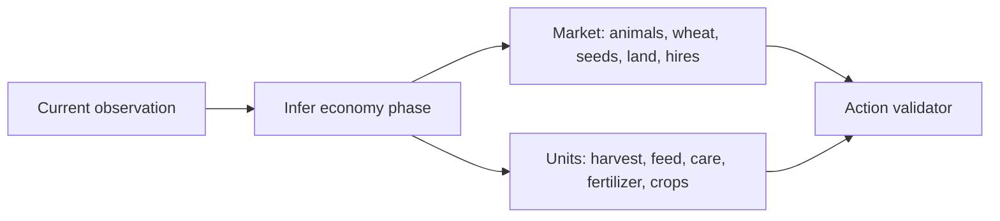

# Leader-inspired benchmark engine

`leader-inspired` is an experimental, deterministic engine derived from the
public actions and states in the supplied `Ryo Hasegawa` replays. It is not the
submission candidate and does not replay fixed coordinates or seeds.



The opening invests in sheep/cows, wheat feed, wheat seed, and low-cost hands.
The scale phase prioritizes feeding, care, fertilizer collection, placement,
and expansion. Crops move from wheat to strawberry and back to wheat later in
the season. Products are sold from the shed every turn, so the strategy remains
safe under capacity pressure.

`leader-v2` is the promoted successor. It creates an explicit daily budget,
production goals, and a one-unit-per-target reservation plan before producing
commands. It only buys an animal when the plan can reserve its structure,
pickup, placement, and feed chain. Its development scenarios use seeds 1–20;
its independent confirmation scenarios use seeds 41–80. It passed all 40
episodes against PASS, random, and `competitive`, with zero errors and
fallbacks, exceeding the 75%/50% promotion thresholds.

Run the evidence extractor without copying replay files into the repository:

```bash
uv run python -m agent.harness audit-replays \
  --input /home/igor/Downloads/kaggle_agro/leader_replays/*.json \
  --output reports/leader-replay-audit
```

Promotion requires the replay-regression tests plus the normal multi-seed
official benchmark matrix. The two source games establish observed behavior,
not a guaranteed optimal policy for every seed or opponent.
