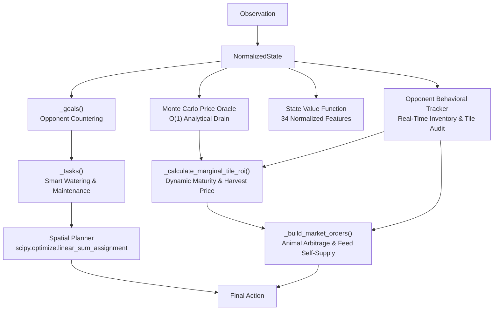

# LEADER-V11: Hybrid Engine with Monte Carlo Oracle, Opponent Arbitrage & Value Function

## Overview

**Leader V11** is the eleventh-generation hybrid strategy for Kaggriculture. It combines Monte Carlo shop sampling, online opponent tracking, dynamic physical maturity verification, Scipy Hungarian spatial planning, and an offline-trained State Value Function regressor.

---

## Decision Flow Diagram

---

## Key Components

### 1. Monte Carlo Price Oracle (`agent/domain/monte_carlo.py`)
- Simulates future market price distributions under shop unlock uncertainty.
- Uses an $O(1)$ closed-form interval calculation (`_analytical_drain`) for $150$ samples in $< 0.5$ms per turn.

### 2. Opponent Behavioral Tracker (`agent/domain/opponent_model.py`)
- Tracks opponent tile counts, money trajectory, and livestock choices.
- Triggers animal arbitrage: pivots to `SHEEP` when opponent over-indexes on `COW`, and opportunistically buys `GOOSE` when `EGG` shops (`BAKERY`/`BRUNCH_SPOT`) are unlocked.

### 3. Dynamic Physical & Market Viability
- Removes static calendar cutoffs.
- Evaluates physical harvest feasibility ($\text{day} + \text{maturity} \le 30$) and harvest-day price projections.

### 4. Hungarian Spatial Planner (`agent/engines/spatial_planner.py`)
- Solves optimal worker task assignment in $O(N^3)$ time via `scipy.optimize.linear_sum_assignment`.

### 5. Offline State Value Function (`agent/domain/value_function.py`)
- Predicts expected terminal wealth difference using a 34-feature vector and a trained `HistGradientBoostingRegressor` model binary (`value_function.joblib`).

---

## Benchmark Results (N=100)

| Matchup | Win Rate | Average Score | Opponent Score | Net Margin |
|:---|:---:|---:|---:|---:|
| **VS LEADER-V7** | **94.0%** | $67,044.32 | $48,521.09 | +$18,523.23 |
| **VS LEADER-V8** | **95.0%** | $65,157.14 | $53,736.63 | +$11,420.51 |
| **VS LEADER-V9** | **70.0%** | $64,037.00 | $62,022.00 | +$2,015.00 |
| **VS LEADER-V9-1** | **65.0%** | $63,683.35 | $62,179.78 | +$1,503.57 |
