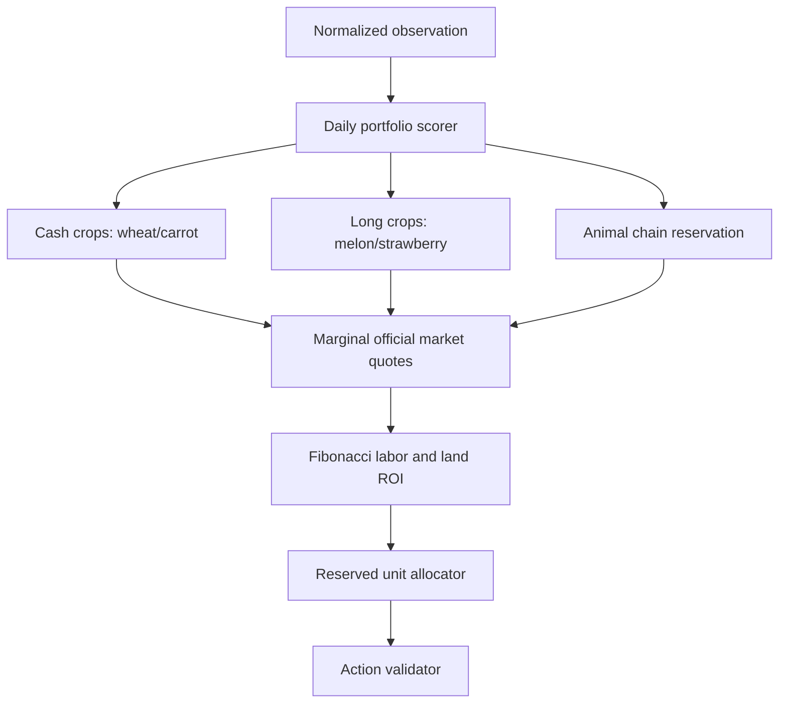

# Leader V3 hybrid portfolio policy

`leader-v3` is an isolated experimental successor to `leader-v2`. The
submission entry point remains V2 until the promotion matrix proves that V3 is
at least as safe and profitable.

The planner scores crops by current price, demand, maturity, and remaining
horizon. Wheat and carrot provide early cash; melon and strawberry are added
only when their maturity fits the season. Sales simulate each unit against the
official market curve and retain feed, with a small opponent-pressure buffer.

Animals are purchased only when an empty pasture, shed headroom, wheat ration,
and the pickup/placement/feed chain are simultaneously available. Hiring uses
the official Fibonacci cost for the current day and compares productive work
against available units. Land is bought only when expected workload over the
remaining horizon covers its configured cost.

V3 is deterministic for a fixed observation. It does not copy replay
coordinates, introduce model dependencies, or alter the strategy-agnostic
harness. Benchmark reports must include zero errors, fallbacks, and illegal
actions before considering promotion.
