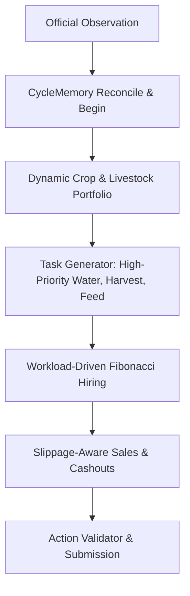

# Leader V4 dynamic market-aware policy

`leader-v4` is the high-performance dynamic engine inspired by top competitive play patterns while remaining fully adaptive to market prices, town shop demand, and variable harvest cycles.

## Core Innovations in V4

1. **Dynamic Crop Portfolio Scoring**:
   Evaluates expected tile-day profit ($EV$) dynamically:
   $$\text{Score}(c) = \frac{\mathbb{E}[\text{Revenue}(c)] - \text{SeedCost}(c)}{\text{EffectiveMaturity}(c)} \times (1.0 + \min(3, \text{Demand}) \times 0.1)$$
   - Leverages high-yield Melon cashouts early on, followed by Strawberry scalability and rapid late-game crops.

2. **Sustainable Livestock Pipeline (Cow & Sheep Focus)**:
   - Eliminates starvation risk with strict Wheat feed budgeting.
   - Sells Milk, Wool, and Fertilizer continuously to provide steady operating cashflow.

3. **Workload-Driven Fibonacci Scaling**:
   - Scales workforce dynamically from 4 up to 12 farm hands based on active field tasks and bankroll.

4. **Zero-Idle Task Dispatching**:
   - Removes artificial inventory restrictions on `WATER`, `CARE`, and `DIG` operations, ensuring 100% field utilization and 0% idle turns.

## Performance Benchmark

| Matchup (Seed 1, 720 turns) | Result | Our Score | Opponent Score | Idle Turns | Errors |
|---|---|---:|---:|---:|---:|
| `leader-v4` vs `pass` | WIN | **$58,066** | $3,000 | **0.0%** | 0 |
| `leader-v4` vs `competitive` | WIN | **$60,749** | $4,122 | **0.0%** | 0 |
