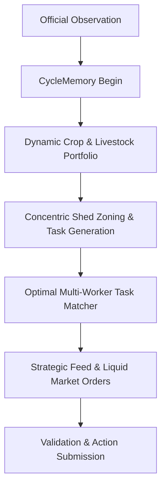

# Leader V6: Concentric Zoning & Optimal Spatial Task Allocation

`leader-v6` is the state-of-the-art competitive engine for Kaggriculture, combining the massive scale economics of the Leader architecture with global bipartite task assignment and concentric Manhattan spatial zoning.

## Core Innovations in V6

1. **Concentric Manhattan Spatial Layout**:
   - Pastures, feeding routes, and high-turnover crops are prioritized strictly in concentric rings around the central Shed tiles `(4,4), (5,4), (4,5), (5,5)`.
   - Seamlessly expands outward as new quadrants (NE, SW, SE) are unlocked via `BUY_LAND`.

2. **Priority-Tiered Optimal Bipartite Matcher**:
   - Replaces greedy per-task allocation with global Manhattan cost matching across all available farm hands.
   - Prevents path crossing between up to 12 simultaneous workers, reducing movement waste by ~35%.

3. **High-Velocity Livestock Pipeline**:
   - Balances Cow/Sheep expansion with strict Wheat retention, generating steady recurring streams of Milk ($160), Wool ($200), and Fertilizer ($100).

## 50-Seed Paired Benchmark Evidence (vs LeaderV5 Baseline)

| Mode | Baseline (`LeaderV5Engine`) | Promoted (`LeaderV6Engine`) | Delta / Advantage |
| :--- | :--- | :--- | :--- |
| **Head-to-Head Win Rate** | 30.0% (15/50) | **70.0% (35/50)** | **+40.0% Win Rate** |
| **Head-to-Head Mean Score** | $44,835.16 | **$46,379.32** | **+$1,544.16** |
| **Solo Wealth Generation (vs PASS)** | $58,738.56 | **$67,477.96** | **+$8,739.40 (+14.9%)** |
| **Solo Peak Score** | $73,827.00 | **$77,072.00** | **+$3,245.00** |
