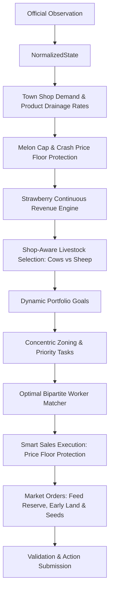

# Leader V8: Market-Resilient & Multi-Commodity Engine

`leader-v8` evolves the state-of-the-art `leader-v7` engine by adding strategic market resilience, anti-flooding controls, and continuous revenue streams.

## Core Innovations in V8

1. **Melon Cap & Market Floor Guard**:
   - Caps total active Melon cultivation at 18 tiles to prevent over-allocation.
   - Automatically halts Melon planting if market Melon inventory is flooded ($< \$100$ price).

2. **Strawberry Continuous Revenue Engine**:
   - Reserves dedicated planting slots for regrowable Strawberries when 2+ unlocked town shops demand Strawberries.
   - Capitalizes on continuous shop consumption, generating recurring yield every 2 days without replanting overhead.

3. **Dairy Scaling & Shop-Aware Livestock Selection**:
   - Dynamically scales Cow capacity targets based on active town dairy shops (`BRUNCH_SPOT`, `ICE_CREAM_SHOP`, `PIZZA_SHOP`, `SMOOTHIE_SHOP`).
   - Dynamically balances animal purchases (Cows vs Sheep) based on whether Yarn Store is unlocked.

4. **Smart Sales Execution**:
   - Protects against dumping Melons at price floor ($1–$4).
   - Holds Melon stock in shed until price recovers or closing liquidation phase begins.

5. **Early Land Acquisition**:
   - Expands land starting on Day 3 (previously Day 4) when liquidity buffer permits, increasing tile yield capacity earlier in the season.
