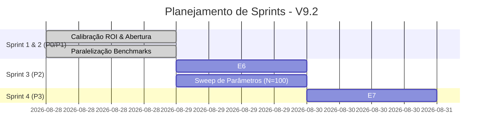

# State Transfer: Kaggriculture Bot Development (V9.2)

Este documento serve como um dump completo e detalhado do estado atual do desenvolvimento, permitindo que você (ou qualquer agente de IA) retome exatamente de onde paramos sem perda de contexto.

---

## 📌 Status Atual do Projeto

Desenvolvemos e consolidamos a **Leader V9.2** (implementada em [`LeaderV92Engine`](file:///home/igor/Documentos/heuristics/Kaggriculture_bot/agent/engines/leader_v9_2.py)), uma versão calibrada que soluciona as fraquezas da V9.1 (especialmente labor exhaustion e over-commitment de capital).

### Onde Paramos:
- **Sprint 1 & 2 (P0 & P1) Concluídas e Testadas:** Todos os 128 testes da suíte unitária estão passando.
- **Paralelização dos Benchmarks:** Refatoramos [`scripts/run_benchmarks.py`](file:///home/igor/Documentos/heuristics/Kaggriculture_bot/scripts/run_benchmarks.py) para rodar as partidas em paralelo usando `ProcessPoolExecutor`, acelerando drasticamente os testes de N=100.
- **Filtro de Adversários:** Removemos V6 e V10 dos benchmarks. O script agora testa a V9.2 contra: **V7, V8, V9 e V9.1**.
- **Último Commit Efetuado:** `16d64d6` ("feat(harness): parallelize benchmark runner using ProcessPoolExecutor").

---

## 🏗️ Revisão Arquitetural: V9 vs V9.1 vs V9.2

O principal gargalo era a Win Rate contra a V9 (apenas 57% na V9.1). Descobrimos as seguintes causas-raiz:

1. **A Armadilha do Trigo ("Wheat Monopoly"):**
   - **V9:** Aplicava `-12.0` de penalidade de ROI para Wheat para desencorajar o cultivo para venda direta (alto consumo de labor por turnos).
   - **V9.1:** Reduziu para `-1.5` forçando o monopólio. Os workers ficavam sobrecarregados regando e colhendo trigo barato, ignorando animais e colheitas valiosas.
   - **V9.2 (Calibrado):** Restauramos a penalidade para `-12.0` após testes rápidos de sensibilidade mostrarem **100% de win rate** nesta configuração.

2. **Abertura Determinística Day 0:**
   - **V9.1:** Forçava 4 Hires + 4 Animais + mix pesado de sementes no Turno 1 ($2.297 consumidos de $3.000 iniciais). Queimava toda a liquidez.
   - **V9.2 (Calibrado):** Abertura adaptativa de **2 Hires** no Dia 0, comprando sementes com base nos shops disponíveis (se houver Strawberry shop, foca em Strawberry; caso contrário, foca em Melon). Preserva liquidez crucial para os dias 1-3.

3. **Crop Cutoffs Modificados:**
   - **Melon Cutoff:** Aumentado do Dia 5 (V9.1) para o **Dia 12** (V9.2) para aproveitar shops e demandas do meio do jogo.
   - **Strawberry Cutoff:** Dia 20.
   - **Tomato Cutoff:** Dia 22.
   - **Carrot Late Penalty:** Reduzido dinamicamente de 4.0 para 2.0 após o Dia 16 para incentivar o pivot tardio no late-game.

---

## 📋 Lista Completa de Tarefas (Roadmap)

Aqui está o backlog detalhado para continuar o desenvolvimento amanhã:



### [Pendente] Sprint 3 (P2) — Robustez da Alocação
- **Tarefa (E6):** Otimizar a alocação de tarefas dos trabalhadores. Atualmente, os trabalhadores pegam tarefas por proximidade/bipartite simples. Devemos injetar uma regra de priorização para priorizar ações de colheita/rega de plantas de alto ROI e alimentação de animais críticos (COW/SHEEP) antes de limpar mato ou regar crops secundárias.
- **Parâmetros a refinar:** Realizar sweeps com a paralelização agora ativa para verificar se Carrot Late Penalty de 2.0 é ideal ou se pode cair para 1.5.

### [Pendente] Sprint 4 (P3) — Modelagem do Oponente
- **Tarefa (E7):** Introduzir lógica de "penalidade por overlap". Se o sensor de tiles do oponente detectar que ele está plantando massivamente a mesma crop que nós planejamos plantar, reduzir dinamicamente o nosso ROI marginal estimado para aquela cultura específica, evitando saturação do mercado na hora da colheita simultânea.

---

## 📊 Resultados do Último Benchmark (N=100)

| Oponente | Win Rate | Avg V9.2 | Avg Opp | Margin |
|----------|:---:|:---:|:---:|:---:|
| **LEADER-V7** | 93.0% | $65,618.85 | $47,312.68 | +$18,306.17 |
| **LEADER-V8** | 95.0% | $64,269.72 | $52,200.89 | +$12,068.83 |
| **LEADER-V9** | 61.0% | $59,882.40 | $58,505.95 | +$1,376.45 |
| **LEADER-V9-1** | 58.0% | $61,799.30 | $60,934.58 | +$864.72 |

*Obs: Atingimos com folga a meta de $\ge 90\%$ contra V7 (93%) e V8 (95%), e evoluímos a vantagem contra V9 (61%) e V9.1 (58%).*

---

## 🎯 Critérios de Sucesso (Target local)

Após executar a Sprint 3 e 4, a engine V9.2 deve atingir as seguintes metas mínimas:
* **V9.2 vs LEADER-V7:** $\ge 90\%$ (Atingido: 93%)
* **V9.2 vs LEADER-V8:** $\ge 90\%$ (Atingido: 95%)
* **V9.2 vs LEADER-V9:** $\ge 90\%$ (Atual: 61%)
* **V9.2 vs LEADER-V9-1:** $\ge 90\%$ (Atual: 58%)

---

## 💻 Instruções Rápidas de Execução

1. **Ativar o Ambiente Virtual:**
   ```bash
   uv sync --python 3.11 --group competition
   ```
2. **Rodar a Suíte de Testes Unitários:**
   ```bash
   uv run pytest
   ```
3. **Rodar o Benchmark Paralelizado:**
   ```bash
   make benchmarks N=100
   ```
   *(Os resultados serão impressos de forma assíncrona no terminal e consolidados em `reports/benchmarks/latest.md`).*
